# 용사 이야기 훈련 교본
- 작성자: 가이우스
- 직급: 전술연산관
- 소속: 테사루스 시엔치에 

"용사 이야기"의 점수판 프로그램은 전장에서 벌어지는 교전 데이터 수집 및 정보 제공 목적으로 제작되었습니다.

사용자들의 원활한 사용을 돕기 위해 아래와 같이 훈련 교본을 작성하였습니다.

## 목차
- [메인 화면 기능 소개](#메인-화면-기능-소개)
- [출전 병사 선택](#출전-병사-선택)
- [보고된 적 선택](#보고된-적-선택)
- [점수판 기능 소개](#점수판-기능-소개)
	- [병사 간편 정보](#병사-간편-정보)
	- [병사 상세 정보](#병사-상세-정보)
	- [적 간편 정보](#적-간편-정보)
	- [적 상세 정보](#적-상세-정보)
		- [증원 보고](#증원-보고)
	- [상세 정보 수정](#상세-정보-수정)
		- [강화 수치 수정](#강화-수치-수정)
		- [체력 및 간단한 데이터 수정](#체력-및-간단한-데이터-수정)
		- [주사위 유효타 수정](#주사위-유효타=수정)
		- [스킬 쿨다운 수정](#스킬-쿨다운-수정)
		- [유물 수정](#유물-수정)
	- [행동 완료 기능 소개](#행동-완료-기능-소개)
	- [턴 수, 날씨 기능 소개](#턴-수,=날씨=기능=소개)
		- [날씨 수정](#날씨-수정)

## 메인 화면 기능 소개
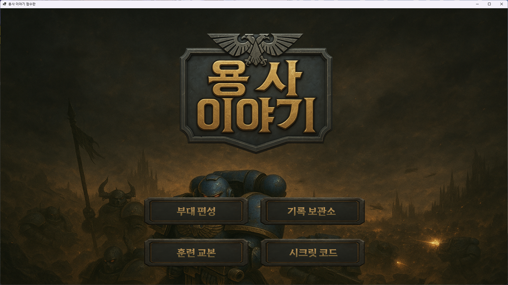
> 2025년 08월 기준 기록 보관소, 시크릿 코드 버튼 미구현

가장 먼저 점수판 프로그램 실행 시 표시되는 화면입니다.
각각 부대편성, 기록 보관소, 훈련 교본, 시크릿 코드 버튼이 있습니다.
    

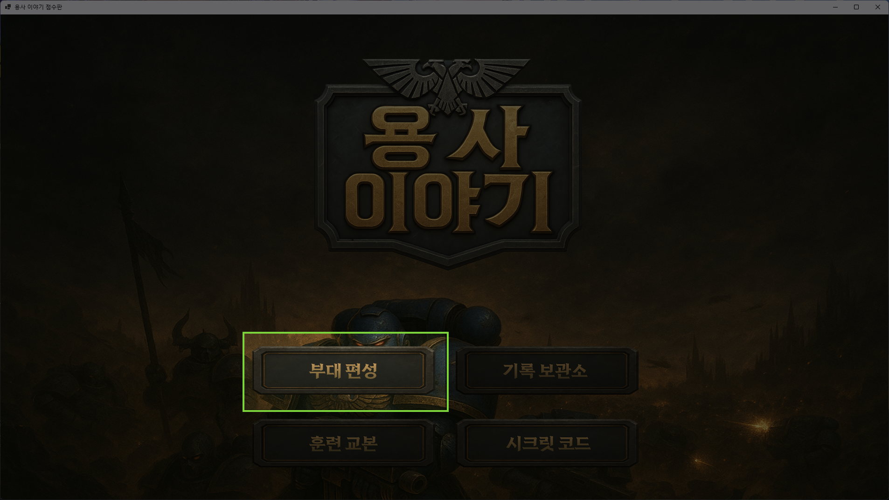
부대 편성 버튼은 출전할 형제들의 정보를 입력하는 기능을 제공합니다.
    

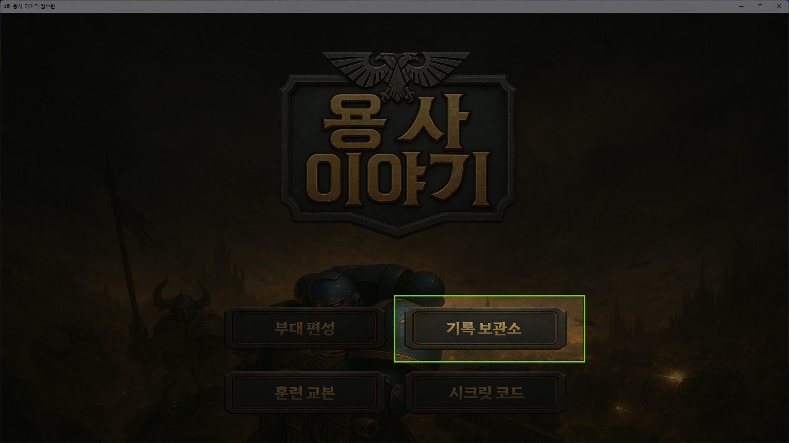
> 미구현된 기능

기록 보관소 버튼은 여러 형제의 전투 기록 또는 적들의 정보 등을 기록해둔 곳입니다.  
    

다음은 훈련 교본 버튼입니다. 클릭 시, 훈련 교본 페이지로 이동합니다.  
현재 보고 계신 이 페이지 말입니다.
    

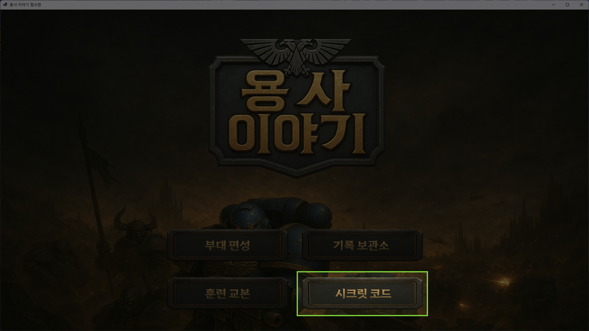
> 미구현된 기능

시크릿 코드를 입력할 수 있는 버튼입니다.  
여러 시크릿 코드를 입력하면 추가 컨텐츠를 해금할 수 있습니다.
    

## 출전 병사 선택
부대편성 버튼 클릭 시 표시되는 화면입니다.

부대편성 화면에서는 해당 표시된 형식의 슬롯이 네 개 존재합니다.  
각 슬롯을 클릭하면 1P부터 4P까지의 형제를 선택하는 팝업창을 띄웁니다.

**해당 팝업창은 ESC를 눌러 닫을 수 있습니다.**
    

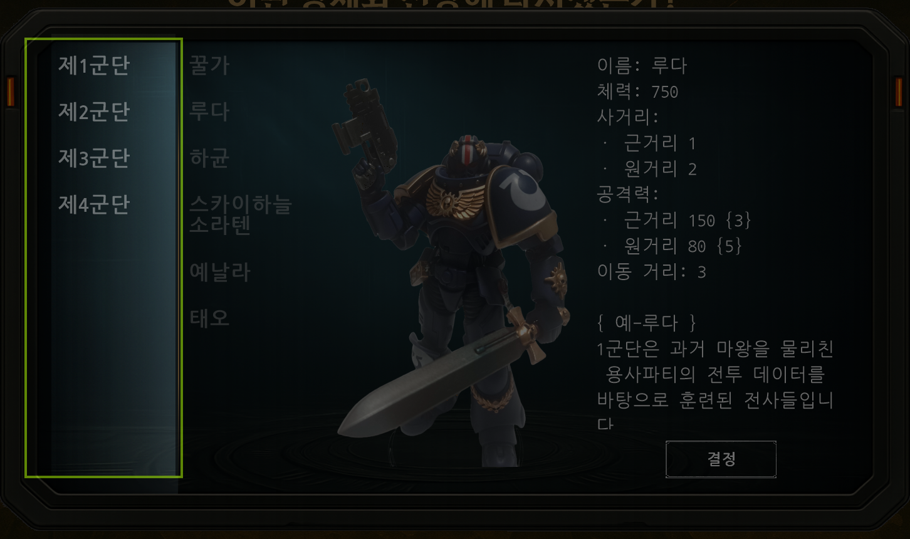
부대편성 화면의 슬롯을 클릭했을 시 뜨는 팝업입니다.  
각 군단을 클릭하여 선택할 수 있습니다.  
군단을 클릭하면 군단별 형제 목록이 표시됩니다.
    

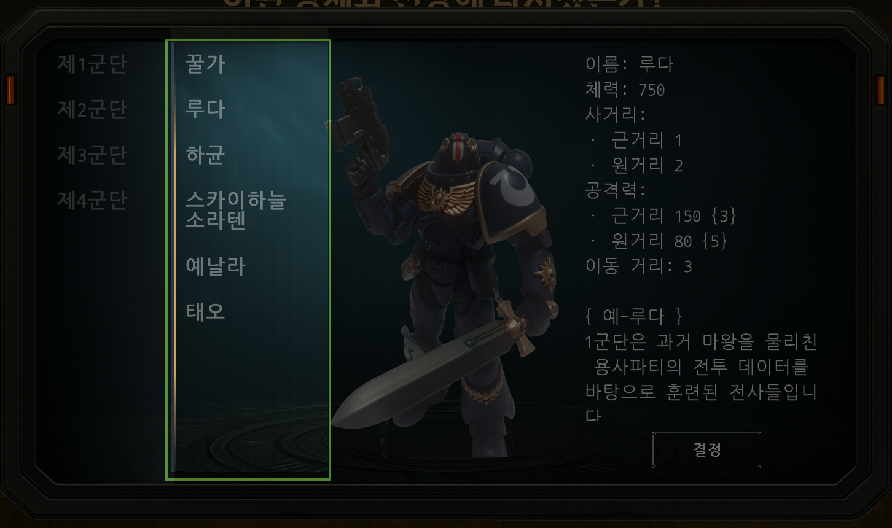
각 군단을 클릭했을 때 표시되는 군단별 형제 목록입니다.  
형제의 이름을 클릭하면 그 형제에 대한 상세 정보가 표시됩니다.
    

형제의 이름을 클릭했을 때 표시되는 형제의 상세 정보입니다.  
스크를링을 하여 형제의 이름, 체력, 사거리, 공격력 등의 스탯을 확인할 수 있으며, 입대 배경 또한 볼 수 있습니다.

**결정 버튼을 클릭하면 슬롯에 세팅됩니다.**
    

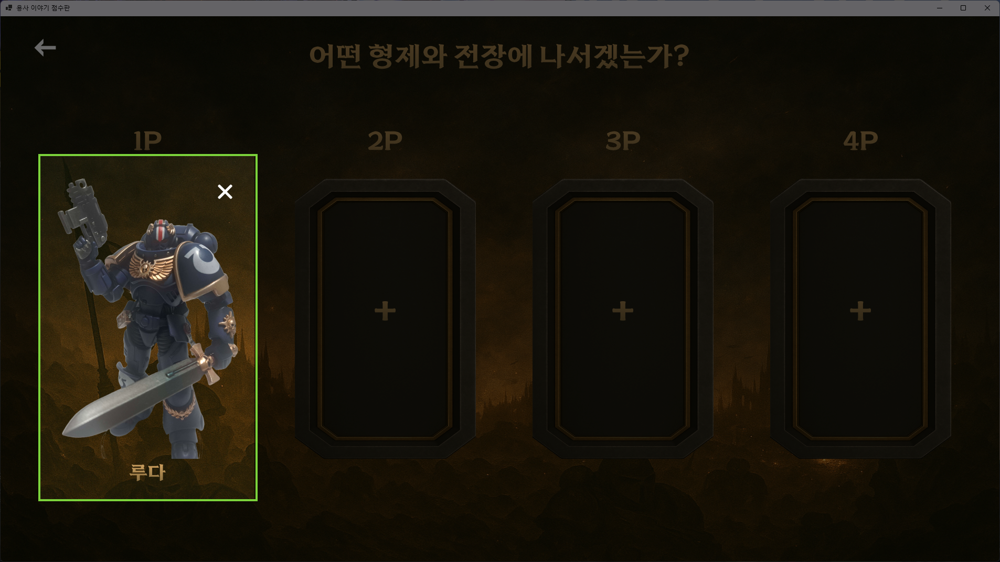
참전이 결정된 형제는 해당 영역과 같이 표시되며, X 버튼으로 참전을 취소할 수 있습니다.
    

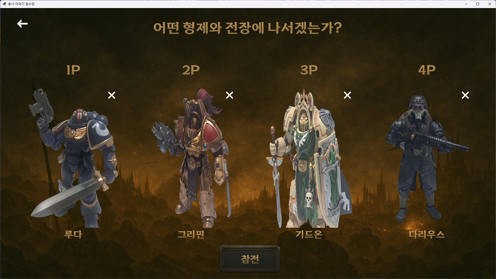
4명의 형제들이 모두 참전을 결정하면, 참전 버튼이 활성화됩니다.

참전 버튼을 클릭하면 적의 정보를 입력할 수 있는 팝업이 표시됩니다.
    

## 보고된 적 선택
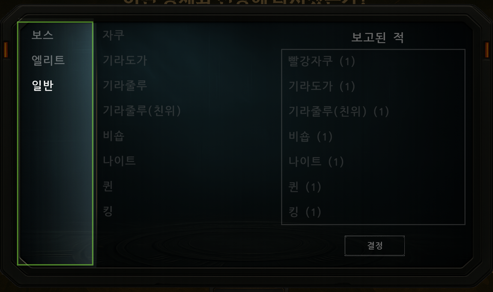
참전 버튼을 클릭했을 때 표시되는 팝업입니다.

적들의 등급을 목록으로 표시하고, 각 등급을 클릭하면 등급별 개체를 선택할 수 있습니다.

**마찬가지로 ESC를 눌러 닫을 수 있습니다.**
    

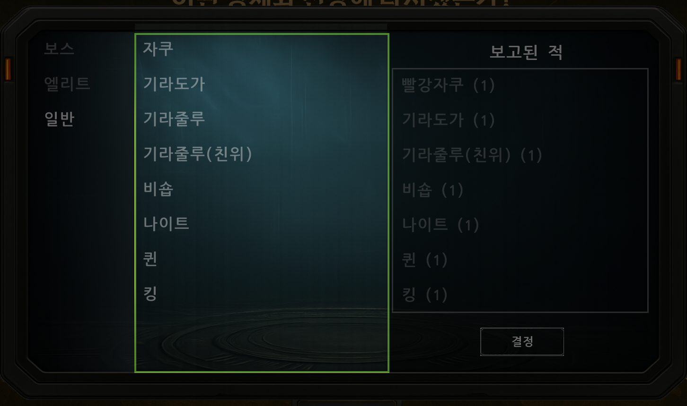
적들의 등급을 클릭하면 해당 등급의 적들을 나열합니다.

적을 클릭하면 "보고된 적" 리스트에 추가됩니다.
    

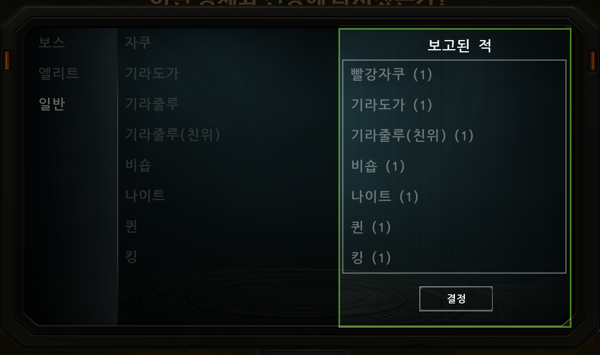
보고된 적들은 개체 수와 함께 표시됩니다.  
이미 보고된 적을 클릭하여 추가하려 하면 개체수가 하나 증가합니다.  
예) 퀸이 한 마리 있는데, 퀸을 한 번 더 클릭하면 퀸(2)로 두 마리 표시됩니다.

보고된 적을 클릭하면 클릭된 적의 개체수가 하나 줄어듭니다.

적을 드래그하여 바깥으로 드랍하면 "보고된 적" 리스트에서 즉시 제거됩니다.

적을 드래그&드랍하여 순서를 바꾸는 것도 가능합니다.

결정 버튼을 클릭하면 보고를 마치고 점수판으로 이동합니다.
    

## 점수판 기능 소개
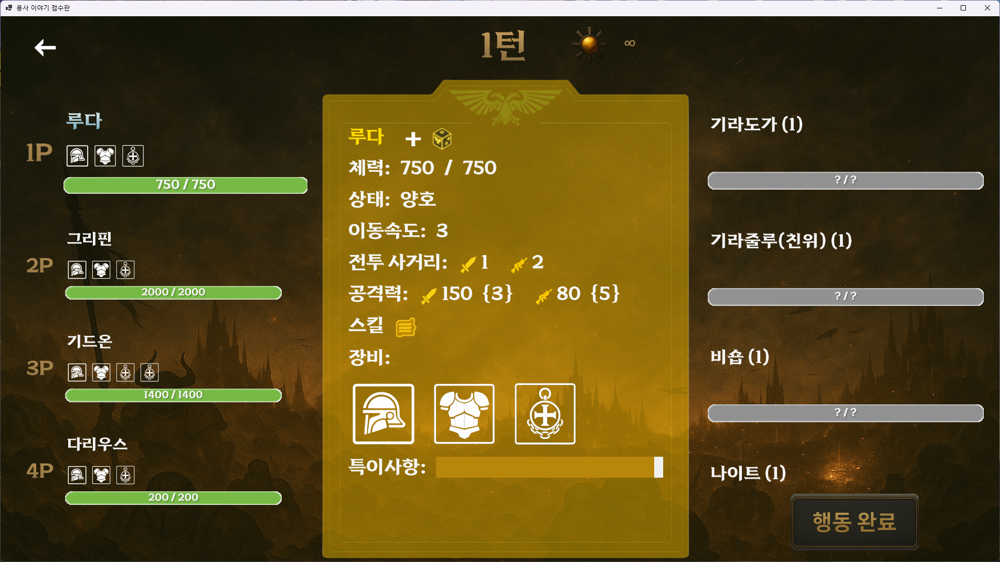
적 보고를 마친 후 표시되는 점수판입니다.
    

### 병사 간편 정보
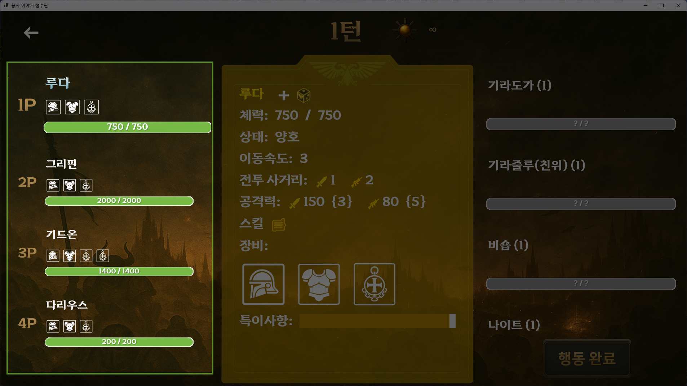
왼편에는 각 형제의 정보가 간략하게 표시됩니다.  
**현재 행동을 할 수 있는 형제는 이름이 파란색**으로 표시됩니다.

간략 정보에 포함되는 내용은 아래와 같습니다.
- 순서(1P, 2P, ...)
- 이름
- 강화 수치
- 상태이상
- 유물
- 체력, 보호막, 최대체력
    

### 병사 상세 정보
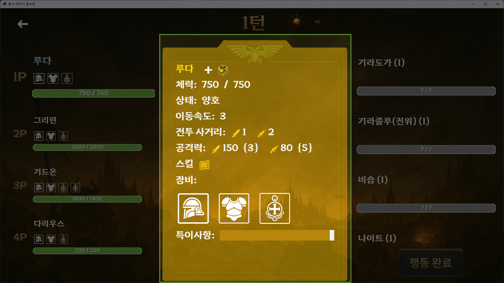
가운데에는 형제 및 적의 상세 정보를 확인할 수 있는 공간이 있습니다.  

이곳에서 바뀌는 전황을 수정하여 반영할 수 있고, 기타 특수한 내용은 특이사항에 적어 관리할 수 있습니다.  
특이사항은 각각의 형제 및 적에게 따로 작성할 수 있습니다.
    

### 적 간편 정보
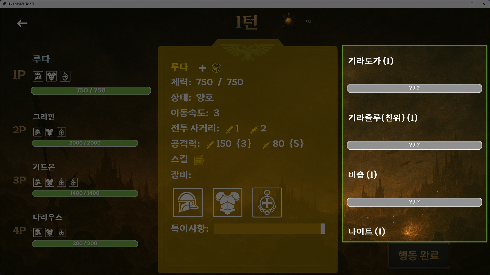
오른쪽에는 적의 정보를 간략하게 확인할 수 있습니다.

**아직 조우하지 않은 적은 미확인 상태**로 표시되며, 상세 정보 또한 열람할 수 있는 부분이 제한적입니다.  

조우한 적은 **해당 적의 패널을 꾸욱 누르면 조우 상태**로 바뀌며 정보를 열람할 수 있습니다.
    

### 적 상세 정보

위에서 작성했듯, 조우하지 않은 적은 해당 화면과 같이 표시됩니다.  
오직 **증원보고, 주사위 유효타 수정**만이 가능합니다.
    

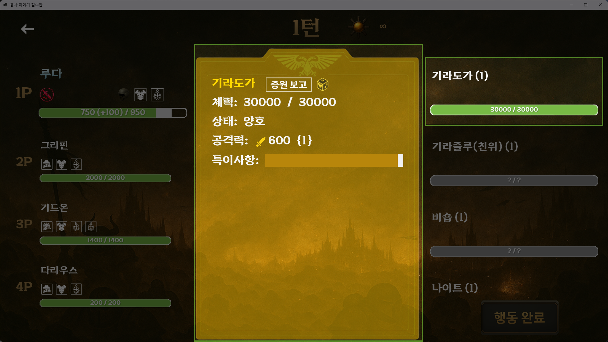
조우한 적은 해당 화면과 같이 표시됩니다.  
간략 정보에서는 체력과 상태이상이 표시됩니다.  
조우한 적은 체력, 상태이상, 공격력, 공격 속도의 수정 또한 가능합니다.
    

#### 증원 보고
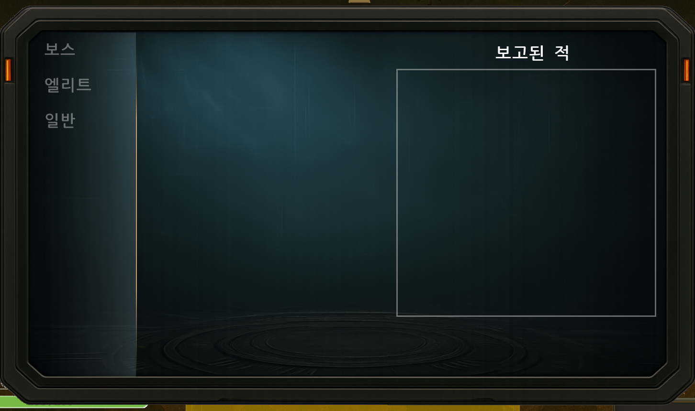
증원보고 버튼을 클릭했을 때 표시되는 팝업입니다.  

이곳에서 실시간으로 증원되는 적들을 보고할 수 있으며, 적을 추가하는 것만 가능합니다.

증원보고된 적은 적 간편 정보에 바로 추가됩니다.

마찬가지로 **ESC를 눌러 증원보고를 취소할 수 있습니다.**
    

### 상세 정보 수정
#### 강화 수치 수정
#### 체력 및 간단한 데이터 수정
#### 주사위 유효타 수정
#### 스킬 쿨다운 수정
#### 유물 수정
### 행동 완료 기능 소개
### 턴 수, 날씨 기능 소개
#### 날씨 수정